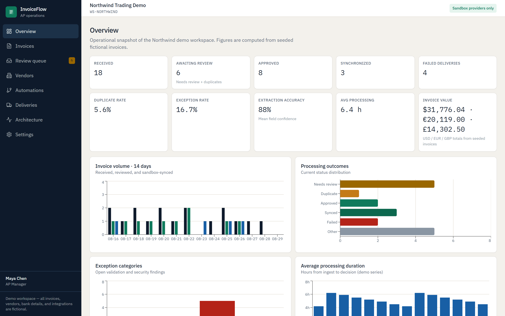
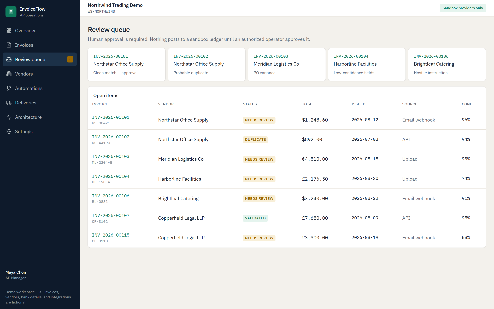
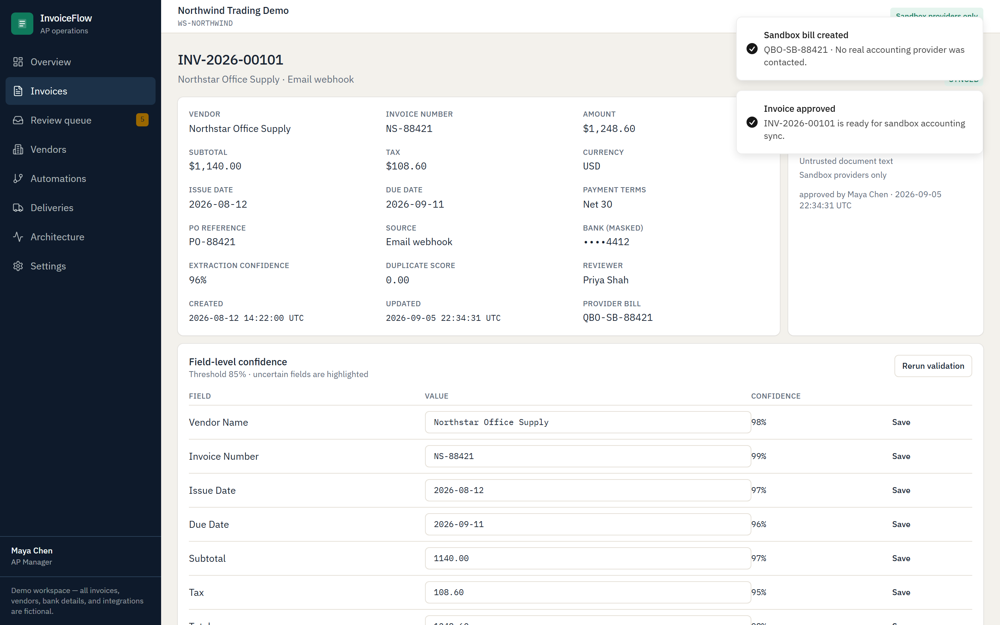
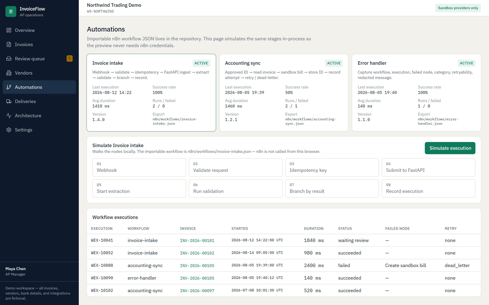
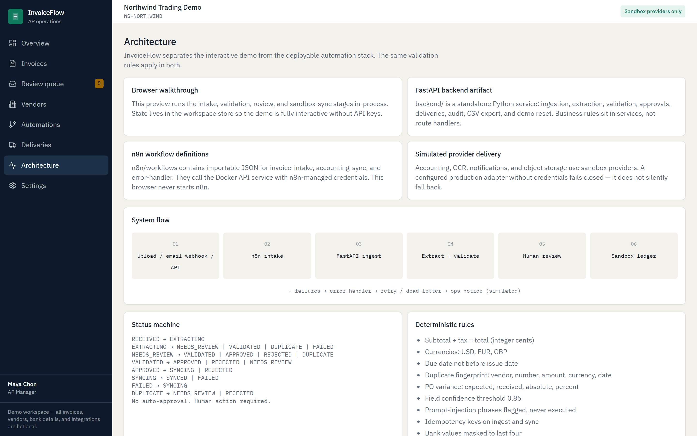

# InvoiceFlow

InvoiceFlow is a **fictional portfolio demonstration** of an invoice-processing and accounts-payable automation workspace. Every company, vendor, invoice, email address, bank suffix, and metric is invented. It never contacts real accounting, banking, email, Slack, QuickBooks, Xero, or other external services.

The product shows how incoming invoices can be extracted, validated, reviewed by a human, and synchronized with a **sandbox** accounting adapter through importable n8n workflows.



## Portfolio walkthrough

| Human review queue | Approved sandbox sync |
|---|---|
|  |  |

| Automation operations | Layered architecture |
|---|---|
|  |  |

## What you are looking at

| Surface | What it is |
|---|---|
| Browser walkthrough | Interactive React workspace (this preview). Runs intake, validation, review, and sandbox sync **in-process**. |
| FastAPI backend | `backend/` — REST API, PostgreSQL/SQLite, Alembic, pytest. |
| n8n workflows | `n8n/workflows/*.json` — real importable definitions. Not executed in the browser. |
| Simulated providers | Sandbox QuickBooks-like bills (`QBO-SB-*`). Production adapters **fail closed** without credentials and never silently fall back. |

## Demo operators

Shared fictional password: `demo-only`

| Name | Email | Role |
|---|---|---|
| Maya Chen | maya.chen@invoiceflow.example | AP Manager (default) |
| Jordan Hale | jordan.hale@invoiceflow.example | Admin |
| Priya Shah | priya.shah@invoiceflow.example | Reviewer |
| Eliot Ward | eliot.ward@invoiceflow.example | Viewer |

Switch operators on **Settings**. Only Admin can reset demo data.

## Local setup (interactive UI)

```bash
npm install
npm run dev          # 0.0.0.0:8080
npm run typecheck
npm run lint
npm test
npm run build
```

## FastAPI backend

```bash
cd backend
pip install -r requirements.txt
uvicorn app.main:app --reload --port 8000
# docs at /docs   health at /health
pytest
ruff check app tests
ruff format --check app tests
mypy app
```

## Docker

```bash
docker compose config
docker compose up --build
# API  :8000   n8n :5678   Postgres :5432
```

Import workflows from `n8n/workflows/` (see `n8n/README.md`).

## Verification commands

```bash
# Frontend
npm run typecheck
npm test
npm run build

# Backend (from backend/)
pytest
ruff check app tests
ruff format --check app tests
mypy app
alembic upgrade head
alembic upgrade head          # second run is a no-op at head
python -c "import asyncio; from app.db.session import init_db,get_session_factory,reset_engine; from app.seed.runner import seed_database
async def main():
    reset_engine(); await init_db(); s=get_session_factory()
    async with s() as session:
        print(await seed_database(session)); print(await seed_database(session)); await session.commit()
asyncio.run(main())"

# Compose
docker compose config
```

## Verified baseline

| Check | Result |
|---|---|
| Frontend domain tests | 20 passed |
| n8n workflow contract checks | 3 workflows passed |
| TypeScript / ESLint / production build | passed |
| FastAPI pytest suite | 74 passed |
| Ruff / mypy | passed |
| Alembic applied twice | second run at head was a no-op |
| Idempotent seed | 18 invoices first run, 0 on the second |
| Browser smoke | desktop + 390 px, no console errors or overflow |
| Docker Compose schema | passed |

## Security model

See [SECURITY.md](SECURITY.md). Document text is untrusted. Prompt-injection style notes are flagged and ignored. Bank numbers are masked to four digits. CSV export is formula-safe. No secrets are committed (`.env.example` only).

## Known limitations

- The hosted preview does not start PostgreSQL, Redis, FastAPI, or n8n. It uses the in-process engine with the same rules.
- Python 3.12 is used for the verified local backend checks and Docker image.
- Production accounting adapters refuse live calls even if placeholder credentials are set.
- There is no real email inbox; “email webhook” is a fictional source label.

Walkthrough, screenshot order, and captions: [DEMO.md](DEMO.md). Architecture: [ARCHITECTURE.md](ARCHITECTURE.md).
